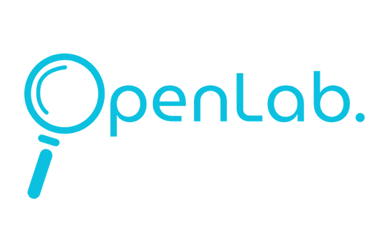

#  OpenLab 🔎

O **OpenLab** é uma plataforma desenvolvida durante o hackathon da **Etec de Peruíbe (2026)**.

O objetivo do projeto é facilitar o acesso de estudantes a laboratórios e salas disponíveis fora do horário de aula, permitindo a reserva de espaços para estudo individual ou trabalhos em grupo.

---

## 📌 Visão geral

O sistema é composto por:

- **Backend** em Node.js
- **Frontend mobile** em React Native
- **Expo** para desenvolvimento e execução do app

Com isso, os alunos podem consultar disponibilidade e reservar ambientes de forma prática.

---

## ✅ Funcionalidades principais

- Consulta de laboratórios e salas disponíveis
- Petição de programas específicos para laboratórios
- Reserva de espaços para estudo
- Consulta de Laboratórios utilizados por professores

---

## 🛠️ Tecnologias utilizadas

- Node.js
- React Native
- Expo

---

## 👥 Grupo de desenvolvimento

- Everton Nascimento Mancio — 3MDS
- Rafael D'Angelo Gradilone Pontes — 3MDS
- Mickael de Almeida Ribeiro — 1MDS
- Edilson Campos da Silva — 1MDS
- Julia Santos Soares — 2MDS
- Daniel Silva Lara Santos — 2MDS
- Bianca Silva Sampaio — 3JOD
- Wendell Rodrigues Oliveira Silva — 3MAD
- Fillipe Marques Rainha — 3MAD
